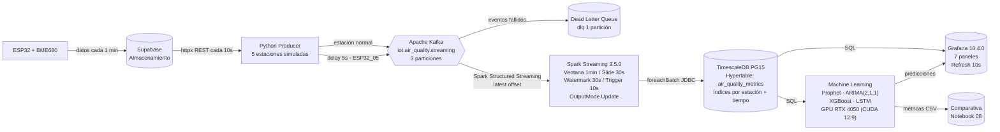
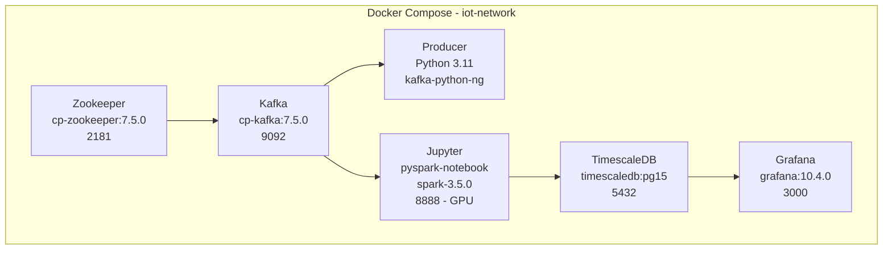

# Arquitectura del Pipeline

## Diagrama de flujo

## Componentes Docker

## Parámetros de Streaming

| Parámetro | Valor |
|---|---|
| Trigger | `processingTime = "10 seconds"` |
| Watermark | `"30 seconds"` |
| Ventana | `1 minute, slide 30 seconds` |
| Output mode | `update` |
| Checkpoint | `/home/jovyan/checkpoint/iot` |
| Spark master | `local[*]` |
