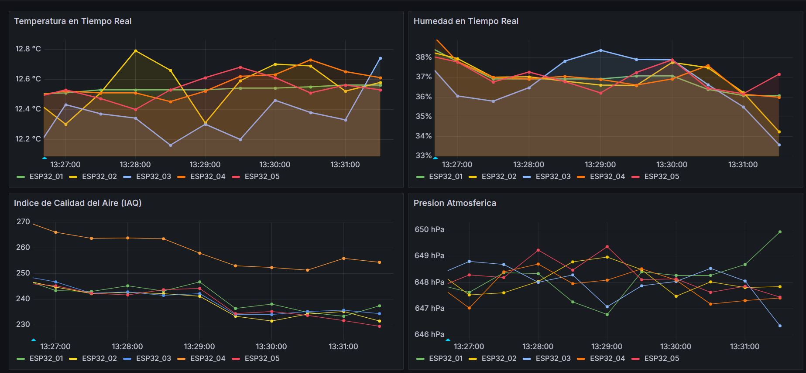

# Dashboard Grafana

## Paneles del Dashboard

| Panel | Métrica | Descripción |
|---|---|---|
| 1 | Temperatura | Temperatura promedio por estación en tiempo real |
| 2 | Humedad | Humedad relativa promedio por estación |
| 3 | IAQ | Índice de calidad del aire con umbrales de color |
| 4 | Presión | Presión atmosférica promedio |
| 5 | Throughput | Cantidad de eventos procesados por ventana |
| 6 | Latencia | Latencia promedio del pipeline en milisegundos |
| 7 | Eventos por estación | Distribución de eventos (pie chart) |

## Captura de pantalla

> Agrega aquí una captura del dashboard funcionando en http://localhost:3000



## Alertas Propuestas

| Alerta | Condición | Acción |
|---|---|---|
| IAQ alto | `avg_iaq > 100` | Notificación en Grafana |
| Temperatura crítica | `avg_temperatura > 35°C o < 0°C` | Alerta |
| Pipeline degradado | `throughput = 0` por >60s | Revisar productor y Kafka |
| Latencia anormal | `latencia_ms > 10000` por >2 ventanas | Posible saturación |

## Dashboard JSON

El dashboard preconfigurado está en:

```
grafana/dashboards/iot_dashboard.json
```

Importar en Grafana: Configuración → Data Sources → PostgreSQL → Import → JSON.
